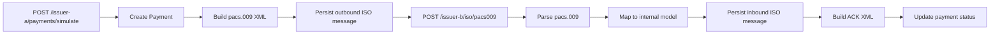

```mermaid
flowchart LR
    A[POST /issuer-a/payments/simulate] --> B[Create Payment]
    B --> C[Build pacs.009 XML]
    C --> D[Persist outbound ISO message]
    D --> E[POST /issuer-b/iso/pacs009]
    E --> F[Parse pacs.009]
    F --> G[Map to internal model]
    G --> H[Persist inbound ISO message]
    H --> I[Build ACK XML]
    I --> J[Update payment status]
```