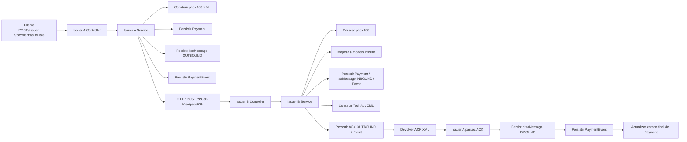

```mermaid
flowchart LR
    A[Cliente<br/>POST /issuer-a/payments/simulate] --> B[Issuer A Controller]
    B --> C[Issuer A Service]
    C --> D[Construir pacs.009 XML]
    C --> E[Persistir Payment]
    C --> F[Persistir IsoMessage OUTBOUND]
    C --> G[Persistir PaymentEvent]
    C --> H[HTTP POST /issuer-b/iso/pacs009]

    H --> I[Issuer B Controller]
    I --> J[Issuer B Service]
    J --> K[Parsear pacs.009]
    J --> L[Mapear a modelo interno]
    J --> M[Persistir Payment / IsoMessage INBOUND / Event]
    J --> N[Construir TechAck XML]
    J --> O[Persistir ACK OUTBOUND + Event]
    O --> P[Devolver ACK XML]

    P --> Q[Issuer A parsea ACK]
    Q --> R[Persistir IsoMessage INBOUND]
    R --> S[Persistir PaymentEvent]
    S --> T[Actualizar estado final del Payment]
```